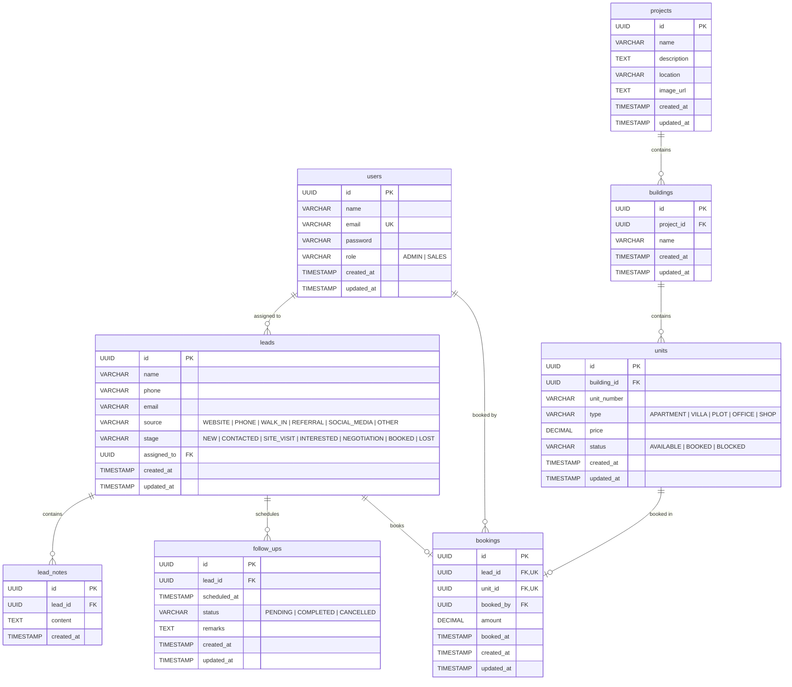

# 🏢 Kosal CRM — Real Estate Customer Relationship & Property Management System

[](https://nodejs.org/)
[](https://expressjs.com/)
[](https://www.postgresql.org/)
[](https://react.dev/)
[](https://vitejs.dev/)
[](https://tailwindcss.com/)
[](https://zod.dev/)

---

## 📑 Table of Contents

- [Key Features](#-key-features)
- [Architecture & Tech Stack](#-architecture--tech-stack)
- [Role-Based Access Control (RBAC)](#-role-based-access-control-rbac)
- [Database Architecture & ER Diagram](#-database-architecture--er-diagram)
- [Project Structure](#-project-structure)
- [Getting Started](#-getting-started)
  - [Prerequisites](#prerequisites)
  - [1. Backend Setup](#1-backend-setup)
  - [2. Database Migration & Seeding](#2-database-migration--seeding)
  - [3. Frontend Setup](#3-frontend-setup)
  - [Default Seed Credentials](#default-seed-credentials)
- [API Reference](#-api-reference)
- [Postman / API Client Collection](#-postman--api-client-collection)
- [Frontend Application Flow](#-frontend-application-flow)
- [License](#-license)

---

## 🚀 Key Features

### 1. 🛡️ Authentication & Role-Based Access Control (RBAC)
- Secure authentication using **Argon2id** password hashing and **JSON Web Tokens (JWT)**.
- Strict multi-tier authorization middleware enforcing **ADMIN** vs **SALES** boundaries.
- Context-aware data scoping: Sales agents automatically view only their assigned leads and bookings, while Admins retain complete visibility.

### 2. 👥 Lead Pipeline & Lifecycle Management
- **Full Lead Lifecycle:** Track customer prospects across 7 stages: `NEW`, `CONTACTED`, `SITE_VISIT`, `INTERESTED`, `NEGOTIATION`, `BOOKED`, and `LOST`.
- **Channel Attribution:** Capture lead sources (`WEBSITE`, `PHONE`, `WALK_IN`, `REFERRAL`, `SOCIAL_MEDIA`, `OTHER`).
- **Activity & Timeline Notes:** Chronological notes log on every lead for tracking customer interactions.
- **Follow-up Reminders:** Schedule future interactions with timestamps and status indicators (`PENDING`, `COMPLETED`, `CANCELLED`).
- **Dynamic Search & Pagination:** Search by name, phone, or email with stage and user filtering.

### 3. 🏗️ Real Estate Inventory Hierarchy
- **Projects:** Top-level development ventures with location, media banners, and descriptions.
- **Buildings / Towers:** Specific blocks or towers situated within each project.
- **Units / Inventory:** Detailed unit configuration including Unit Number, Type (`APARTMENT`, `VILLA`, `PLOT`, `OFFICE`, `SHOP`), Price, and Status (`AVAILABLE`, `BOOKED`, `BLOCKED`).

### 4. 💳 ACID-Compliant Transactional Bookings
- Prevents race conditions and double-booking using PostgreSQL row-level locks (`SELECT ... FOR UPDATE`).
- Commits booking creation, unit status change (`AVAILABLE` ➔ `BOOKED`), and lead stage transition (`BOOKED`) inside a single atomic database transaction (`BEGIN ... COMMIT ... ROLLBACK`).

### 5. 📊 Real-Time KPI Dashboard
- Instant pipeline conversion metrics (counts per lead stage).
- Immediate visibility on **Follow-ups scheduled for today** and **Overdue/Pending follow-ups**.
- Total bookings count and gross booking revenue generated.
- Inventory availability breakdown (Available vs. Booked vs. Blocked).

---

## 🛠️ Architecture & Tech Stack

```
 ┌────────────────────────────────────────────────────────┐
 │                   React 19 Frontend                    │
 │   Vite • Tailwind CSS v4 • React Router v7 • Axios     │
 └───────────────────────────┬────────────────────────────┘
                             │ REST API (Bearer JWT)
                             ▼
 ┌────────────────────────────────────────────────────────┐
 │                   Express 5 Server                     │
 │      Routes ──► Middleware (Auth, RBAC, Zod)           │
 │      Controllers ──► Services ──► Repositories         │
 └───────────────────────────┬────────────────────────────┘
                             │ Connection Pooling (pg.Pool)
                             ▼
 ┌────────────────────────────────────────────────────────┐
 │                 PostgreSQL Database                    │
 │  Foreign Keys • Check Constraints • Triggers • Indexes │
 └────────────────────────────────────────────────────────┘
```

### Backend (`/server`)
- **Runtime:** Node.js (ES Modules)
- **Framework:** Express 5.x
- **Database Driver:** `pg` (Node-Postgres with connection pooling)
- **Validation:** Zod schemas for all inbound payloads
- **Security & Cryptography:** Argon2 for passwords, JSON Web Tokens (`jsonwebtoken`)
- **CORS:** Cross-Origin Resource Sharing enabled

### Frontend (`/client`)
- **Framework:** React 19 (SPA)
- **Build Tool:** Vite 8.x with HMR
- **Routing:** React Router v7 with Protected and Role-guarded routes
- **Styling:** Tailwind CSS v4
- **State Management:** React Context API (`AuthContext`, `ThemeContext` for Light/Dark mode)
- **HTTP Client:** Axios with request interceptors for automatic Bearer token injection

---

## 🔐 Role-Based Access Control (RBAC)

| Capability / Resource | ADMIN | SALES |
|:---|:---:|:---:|
| Login & View Own Profile (`/me`) | ✅ | ✅ |
| View System Dashboard | ✅ (All metrics) | ✅ (Scoped to own leads/bookings) |
| Create Sales Users | ✅ | ❌ |
| View User Directory | ✅ | ❌ |
| Create Lead | ✅ (Can assign to anyone) | ✅ (Automatically assigned to self) |
| View Leads | ✅ (All leads) | ✅ (Only assigned leads) |
| Update Lead Details / Stage | ✅ | ✅ (Only assigned leads) |
| Assign Lead to Sales Rep | ✅ | ❌ |
| Delete Lead | ✅ | ✅ (Only assigned leads) |
| Add Notes & Follow-ups | ✅ | ✅ (Only assigned leads) |
| Create / Update / Delete Projects | ✅ | ❌ |
| Create / Update / Delete Buildings | ✅ | ❌ |
| Create / Update Units | ✅ | ❌ |
| View Projects, Buildings, Units | ✅ | ✅ |
| Create Booking (Commit Unit) | ✅ | ✅ (For assigned leads) |
| View All Bookings | ✅ (All records) | ✅ (Only self-booked records) |

---

## 🗄️ Database Architecture & ER Diagram

The database utilizes PostgreSQL with UUID primary keys (`pgcrypto` extension), referential integrity constraints, and indexes on critical query paths.



---

## 📁 Project Structure

```
Kosal-CRM/
├── Kosal-CRM.postman_collection.json  # Complete Postman Collection v2.1.0
├── README.md                          # Full system documentation
│
├── server/                            # Express 5 REST API
│   ├── .env.example                   # Backend environment template
│   ├── package.json
│   └── src/
│       ├── server.js                  # Entry point & HTTP listener
│       ├── app.js                     # Express app setup, CORS, route mounting
│       ├── config/
│       │   └── db.js                  # PostgreSQL pg.Pool configuration
│       ├── database/
│       │   ├── migrations/
│       │   │   └── 001_initial_schema.sql  # Database DDL & indices
│       │   └── seeds/
│       │       └── seed.js            # Initial Admin & Sales accounts seed
│       ├── middleware/
│       │   ├── auth.middleware.js     # JWT verification
│       │   ├── role.middleware.js     # RBAC role guards (ADMIN, SALES)
│       │   ├── validate.middleware.js # Zod schema request validation
│       │   └── error.middleware.js    # Global centralized error handler
│       └── modules/
│           ├── auth/                  # Login, current user, role verification
│           ├── users/                 # User directory & sales agent creation
│           ├── leads/                 # Leads CRUD, notes, follow-up handlers
│           ├── properties/            # Projects, buildings, units inventory
│           ├── bookings/              # Atomic ACID booking transactions
│           └── dashboard/             # Real-time analytics aggregation
│
└── client/                            # React 19 Frontend (Vite)
    ├── .env.example                   # Client environment template
    ├── index.html
    ├── package.json
    ├── vite.config.js
    └── src/
        ├── App.jsx                    # Route definitions & guards
        ├── main.jsx                   # React root mount
        ├── index.css                  # Tailwind styles
        ├── api/                       # Modular Axios API service wrappers
        ├── context/                   # AuthContext & ThemeContext
        ├── layouts/                   # DashboardLayout with Sidebar & Topbar
        ├── routes/                    # ProtectedRoute & RoleRoute components
        ├── components/                # Reusable UI widgets & modal forms
        └── pages/                     # Application views (Dashboard, Leads,
                                       # Properties, Units, Bookings, Users, Login)
```

---

## 🚦 Getting Started

### Prerequisites
- **Node.js:** v18.0.0 or higher ([Download](https://nodejs.org/))
- **npm:** v9.0.0 or higher
- **PostgreSQL:** v14.0 or higher (Local instance, or cloud-hosted on [Neon](https://neon.tech), [Supabase](https://supabase.com), or [Render](https://render.com))

---

### 1. Backend Setup

1. Open your terminal and navigate to the `server` directory:
   ```bash
   cd server
   ```

2. Install backend dependencies:
   ```bash
   npm install
   ```

3. Create your `.env` file from the provided `.env.example`:
   ```bash
   cp .env.example .env
   ```

4. Configure the environment variables inside `server/.env`:
   ```env
   PORT=5000
   DATABASE_URL=postgresql://<user>:<password>@<host>:<port>/<database>?sslmode=require
   JWT_SECRET=your_secure_jwt_secret_key_change_in_production
   JWT_EXPIRES_IN=1d
   ```

---

### 2. Database Migration & Seeding

1. Execute the SQL schema against your PostgreSQL database.
   - If using `psql`:
     ```bash
     psql -d "your_database_url" -f src/database/migrations/001_initial_schema.sql
     ```
   - Or paste the contents of `server/src/database/migrations/001_initial_schema.sql` into your database management GUI (DBeaver, pgAdmin, or Neon Console).

2. Run the seed script to populate default Admin and Sales accounts:
   ```bash
   npm run seed
   ```

3. Start the backend server:
   ```bash
   # Development mode with Nodemon auto-reload:
   npm run dev

   # Or Production mode:
   npm start
   ```
   The server will start listening at `http://localhost:5000`. Test health at `http://localhost:5000/health`.

---

### 3. Frontend Setup

1. Open a new terminal tab and navigate to the `client` directory:
   ```bash
   cd client
   ```

2. Install frontend dependencies:
   ```bash
   npm install
   ```

3. Create your `.env` file from the provided `.env.example`:
   ```bash
   cp .env.example .env
   ```

4. Ensure your `client/.env` points to your backend:
   ```env
   VITE_API_URL=http://localhost:5000/api
   ```

5. Start the Vite development server:
   ```bash
   npm run dev
   ```
   Open your browser and navigate to `http://localhost:5173`.

---

### 🔑 Default Seed Credentials

When you run `npm run seed`, the following default user accounts are provisioned:

| Role | Email | Password | Permissions |
|:---|:---|:---|:---|
| **ADMIN** | `admin@realestate.com` | `Admin@123` | Full access: User management, Projects, Buildings, Units, Assigning leads, Global dashboard |
| **SALES** | `sales@realestate.com` | `Sales@123` | Sales representative: Own leads, follow-ups, notes, booking available units |

---

## 📡 API Reference

All protected endpoints require the following header:
```http
Authorization: Bearer <your_jwt_token>
```

### 0. Health Check
| Method | Endpoint | Access | Description |
|:---|:---|:---|:---|
| `GET` | `/health` | Public | Checks server status and live PostgreSQL DB connection. |

---

### 1. Authentication (`/api/auth`)
| Method | Endpoint | Access | Description |
|:---|:---|:---|:---|
| `POST` | `/api/auth/login` | Public | Authenticates credentials and returns JWT token + user profile. |
| `GET` | `/api/auth/me` | Authenticated | Retrieves current logged-in user profile. |
| `GET` | `/api/auth/admin-test` | ADMIN | Role verification test endpoint. |

#### Login Request Body:
```json
{
  "email": "admin@realestate.com",
  "password": "Admin@123"
}
```

---

### 2. User Management (`/api/users`)
| Method | Endpoint | Access | Description |
|:---|:---|:---|:---|
| `POST` | `/api/users` | ADMIN | Creates a new Sales employee account. |
| `GET` | `/api/users?page=1&limit=10` | ADMIN | Lists all system users with pagination. |

#### Create User Request Body:
```json
{
  "name": "Jane Doe",
  "email": "jane.doe@realestate.com",
  "password": "Password@123"
}
```

---

### 3. Lead Management (`/api/leads`)
| Method | Endpoint | Access | Description |
|:---|:---|:---|:---|
| `POST` | `/api/leads` | Authenticated | Creates a new customer lead. |
| `GET` | `/api/leads` | Authenticated | Lists leads with pagination (`page`, `limit`), search query (`search`), and stage filter (`stage`). |
| `GET` | `/api/leads/:id` | Authenticated | Retrieves single lead details by UUID. |
| `PATCH` | `/api/leads/:id` | Authenticated | Updates lead attributes (name, phone, stage, source). |
| `PATCH` | `/api/leads/:id/assign` | ADMIN | Reassigns a lead to another sales representative. |
| `DELETE` | `/api/leads/:id` | Authenticated | Deletes a lead and cascades related notes & follow-ups. |

#### Create Lead Request Body:
```json
{
  "name": "Robert California",
  "phone": "+1-555-0144",
  "email": "robert.c@example.com",
  "source": "WEBSITE",
  "stage": "NEW"
}
```

---

### 4. Lead Notes (`/api/leads/:id/notes`)
| Method | Endpoint | Access | Description |
|:---|:---|:---|:---|
| `POST` | `/api/leads/:id/notes` | Authenticated | Adds an activity/interaction note to a lead. |
| `GET` | `/api/leads/:id/notes` | Authenticated | Fetches all notes associated with a lead. |
| `DELETE` | `/api/leads/:id/notes/:noteId` | Authenticated | Removes a specific note from a lead. |

#### Add Note Request Body:
```json
{
  "content": "Customer requested detailed floor plans for 3-bedroom penthouses."
}
```

---

### 5. Lead Follow-ups (`/api/leads/:id/follow-ups`)
| Method | Endpoint | Access | Description |
|:---|:---|:---|:---|
| `POST` | `/api/leads/:id/follow-ups` | Authenticated | Schedules a follow-up reminder/call/meeting. |
| `GET` | `/api/leads/:id/follow-ups` | Authenticated | Lists all scheduled follow-ups for a lead. |
| `PATCH` | `/api/leads/:id/follow-ups/:followUpId` | Authenticated | Updates follow-up status (`PENDING`, `COMPLETED`, `CANCELLED`) or remarks. |

#### Schedule Follow-up Request Body:
```json
{
  "scheduledAt": "2026-09-20T11:00:00.000Z",
  "remarks": "Follow-up call to review revised quotation."
}
```

---

### 6. Property Inventory (`/api/projects`)

#### Projects
| Method | Endpoint | Access | Description |
|:---|:---|:---|:---|
| `POST` | `/api/projects` | ADMIN | Creates a new development project. |
| `GET` | `/api/projects?page=1&limit=10` | Authenticated | Lists all projects with pagination. |
| `GET` | `/api/projects/:id` | Authenticated | Gets project details by UUID. |
| `PATCH` | `/api/projects/:id` | ADMIN | Updates project title, location, media URL. |
| `DELETE` | `/api/projects/:id` | ADMIN | Deletes project and cascades buildings/units. |

#### Buildings
| Method | Endpoint | Access | Description |
|:---|:---|:---|:---|
| `POST` | `/api/projects/:projectId/buildings` | ADMIN | Adds a new building/tower to a project. |
| `GET` | `/api/projects/:projectId/buildings` | Authenticated | Lists all buildings inside a project. |
| `GET` | `/api/projects/buildings/:id` | Authenticated | Gets single building details. |
| `PATCH` | `/api/projects/buildings/:id` | ADMIN | Renames/updates a building. |
| `DELETE` | `/api/projects/buildings/:id` | ADMIN | Deletes a building and its units. |

#### Units
| Method | Endpoint | Access | Description |
|:---|:---|:---|:---|
| `POST` | `/api/projects/buildings/:buildingId/units` | ADMIN | Adds a unit to a building. |
| `GET` | `/api/projects/buildings/:buildingId/units` | Authenticated | Lists units with filters (`status`, `type`). |
| `GET` | `/api/projects/units/:id` | Authenticated | Gets single unit details. |
| `PATCH` | `/api/projects/units/:id` | ADMIN | Updates unit price, number, or status. |

#### Create Unit Request Body:
```json
{
  "unitNumber": "A-501",
  "type": "APARTMENT",
  "price": 185000.00,
  "status": "AVAILABLE"
}
```

---

### 7. Bookings (`/api/bookings`)
| Method | Endpoint | Access | Description |
|:---|:---|:---|:---|
| `POST` | `/api/bookings` | Authenticated | Concurrently locks unit (`FOR UPDATE`), verifies availability, creates booking, and sets unit and lead status to `BOOKED`. |
| `GET` | `/api/bookings?page=1&limit=10` | Authenticated | Lists bookings with full joins (Lead, Unit, Building, Project, Agent). |
| `GET` | `/api/bookings/:id` | Authenticated | Gets single booking details. |

#### Create Booking Request Body:
```json
{
  "leadId": "3fa85f64-5717-4562-b3fc-2c963f66afa6",
  "unitId": "7cb85f64-5717-4562-b3fc-2c963f66afb7",
  "amount": 25000.00
}
```

---

### 8. Dashboard Analytics (`/api/dashboard`)
| Method | Endpoint | Access | Description |
|:---|:---|:---|:---|
| `GET` | `/api/dashboard` | Authenticated | Returns real-time KPIs (lead conversion counts, today's follow-ups, total bookings, inventory counts). |

---

## 📮 Postman / API Client Collection

A ready-to-use Postman Collection is provided in the repository root:
📄 **[`Kosal-CRM.postman_collection.json`](./Kosal-CRM.postman_collection.json)**

### How to use:
1. Open **Postman**, **Insomnia**, **Thunder Client**, or **Bruno**.
2. Click **Import** and select `Kosal-CRM.postman_collection.json`.
3. The collection is preconfigured with:
   - Collection variables: `baseUrl` (defaults to `http://localhost:5000`), `adminEmail`, `adminPassword`, `salesEmail`, `salesPassword`.
   - **Automated Authentication Scripts:** Executing `Login - Admin` or `Login - Sales Rep` will automatically extract the bearer token and inject it into the `{{token}}` variable for all subsequent calls.
   - **Cascading Variables:** Creating a Lead, Project, Building, Unit, or Booking automatically sets `{{leadId}}`, `{{projectId}}`, `{{buildingId}}`, `{{unitId}}`, and `{{bookingId}}` for downstream requests.

---

## 🖥️ Frontend Application Flow

- `/login` — Clean, modern login screen with instant role detection.
- `/dashboard` — KPI cards, conversion pipeline statistics, urgent follow-up notifications.
- `/leads` — Full data table with search, stage badges, inline filters, and lead creation modal.
- `/leads/:id` — Lead overview, editable fields, interaction notes timeline, and follow-up scheduler.
- `/properties/projects` — Project catalog cards with image banners and location summaries.
- `/properties/projects/:id` — Project building inventory and tower breakdown.
- `/properties/buildings/:buildingId/units` — Floor and unit grid with status badges (Available, Booked, Blocked).
- `/bookings` — Complete booking registry with financial amount and unit assignment.
- `/users` — Admin-only sales team provisioning and user list.

---
